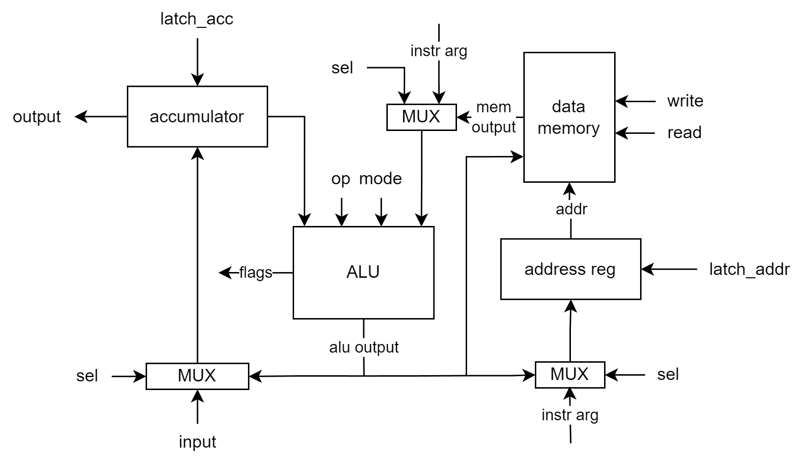

# Alg. Транслятор и модель процессора

- Муратов Михаил Александрович, P3209
- alg ~~-> asm~~ | acc | harv | hw | instr | binary ~~-> struct~~ | stream | port | pstr | prob1 | ~~cache~~
- Базовый вариант

Требования к реализации: https://gitlab.se.ifmo.ru/computer-systems/csa-rolling/-/blob/master/lab3-task.md

## Язык программирования

``` ebnf
<program> ::= <statement>*
<statement> ::= <assignment> | <print_statement> | <input_statement> | <conditional_statement> | <loop_statement>
<assignment> ::= <variable> "=" <expression>
<print_statement> ::= ("/out" | ">") <expression>
<input_statement> ::= "/in" <variable>
<conditional_statement> ::= "if" <expression> ":" <program> ";"
<loop_statement> ::= "while" <expression> ":" <program> ";"

<expression> ::= <unary_expr> | <expression> ( "+" | "-" | "*" | "/" | "%" | '&&' | '||' | "<" | ">" | "<=" | ">=" | "==" | "!=" ) <expression>
<unary_expr> ::= <term> | "!" <term>
<term> ::= <variable> | <string_literal> | <number> | <expression> | "(" <expression> ")"

<variable> ::= "[_a-zA-Z]\w*"
<string_literal> ::= "'[^']*'"
<number> ::= "[+-]?[1-9]\d*|0"
```

В языке реализованны следующие возможности:
- Переменные типа `int` и `string`, строковые литералы и числовые константы
- Ввод/вывод данных (ввод только строк)
- Условия (`if`) и циклы (`while`) с любым уровнем вложенности и своей областью видимости
- Математические выражения со всеми основными операциями (в том числе логическими) и любой вложенностью скобок
- Получение длины строки (подробней об этом ниже)

Особенности синтаксиса и работы:
- Команды разделяются переносом строки, отступы не важны. Блоки кода (`if` и `while`) начинаются с `:` и заканчиваются `;` (на отдельной строке).
- Так называемые "системные команды", которые начинаются с символа `/` (на данный момент реализованы только `/in` и `/out`).
Такой синтаксис сделан специально, чтобы не использовать скобки, т.к. тогда возникает аналогия с функциями, которые в языке отсутствуют.
- Типы переменных не указываются явно, но при объявлении программист обязан инициализировать переменную значением типа `int` или `string`.
Вследствие чего - статическая типизация, которая проверяется полностью на этапе трансляции.
- Так как логический тип данных отсутствует, логические операции приводят к числу 0 или 1.
- Строки иммутабельны и хранятся по значению. Они также ограничены 63 символами (подробней об этом в следующем разделе).
- Есть возможность получить длину строки, если использовать её в математическом выражении
(это лего достижимо благодаря тому, что строки хранятся как length-prefixed). Например, можно написать `s = 'hey'` и `n = s + 2` и получить, что `n = 5`.
- Ввод строки завершается на символе `\n` либо `EOF`.

## Организация памяти
**Память команд:**
- Машинное слово - 5 байт (40 бит).
- Максимальный размер памяти - 2^31 ячеек.
- Команды хранятся последовательно, начиная с адреса 0x0.
- Три вида **адресации**: прямая, косвенная и непосредственная.
  - При прямой, аргументом команды служит адрес, по которому хранятся данные. Пример: `CMP 666`.
  - При косвенной - адрес, по которому хранится адрес, где хранятся данные. Пример: `LD ~12`.
  - При непосредственной - сами данные. Пример: `ADD #-42`.

**Память данных:**
- Машинное слово - 4 байта (32 бита), знаковое.
- Максимальный размер памяти - 2^31 ячеек.
- Изначально память заполнена **строковыми литералами**, располагающимися последовательно, начиная с адреса 0x0.
Заполнение происходит на первом этапе трансляции.
- Далее транслятор подставляет в машинные команды **адреса переменных**, которые растут вниз сразу после строковых литералов
в порядке их объявления в программе. Заполняются они, разумеется, во время исполнения.
- На каждую **строковую переменную** выделяется ровно по 64 ячейки, где самая первая - размер строки, и далее по ячейке на каждый символ.
Под строковые же литералы память выделяется в соответствии с длиной строки (но не более 64 ячеек).  
- **Числовые константы** всегда являются аргументами инструкций и не сохраняются в память.
- Промежуточные результаты **математических выражений** сохраняются в память временно, после последней объявленной переменной (то есть предшествующей этому математическому выражению).

**Регистры:**
- `accumulator` хранит результаты вычислений. Через него же осуществляется ввод/вывод.
- `address reg` хранит адрес ячейки памяти, откуда происходит чтение или куда записываются данные.
- `instr pointer` указывает на адрес следующей инструкции.
- Каждый регистр имеет размер 4 байта.

## Система команд
Особенности процессора:
- Обработка данных связана с т.н. адресными командами и приводит к изменению значения в аккумуляторе (см. раздел "Набор инструкций").
- Доступ к памяти данных осуществляется по адресу, хранящемуся в адресном регистре. 
Установка адреса происходит при использовании адресных команды (режимы адресации описаны в предыдущем разделе).
- Аккумулятор и вывод из памяти приходят на левый и правый вход АЛУ, которое может произвести математические операции с ними.
АЛУ устанавливает флаги по операции и его выход соединен с аккумулятором и адресным регистром (подробности в разделе "DataPath"). 
- Поток управления:
    - инкремент `instr pointer` после каждой инструкции
    - условные и безусловный переходы
    - остановка потока по команде `HLT`
- Port-mapped ввод-вывод происходит через команды `IN`, `OUT` и `OUTN`, которые получают/отдают данные в аккумулятор из собственного адресного пространства.

### Набор инструкций
| Код  | Инструкция | Тип          | Описание                                    |
|------|------------|--------------|---------------------------------------------|
| 0x1  | HLT        | Безадресная  | Завершение работы программы                 |
| 0x4  | LD M       | Адресная     | Загрузка M в ACC                            |
| 0x5  | ST M       | .            | Сохранение значения из ACC в M              |
| 0x6  | ADD M      | .            | Сложить значение M с ACC                    |
| 0x7  | SUB M      | .            | Вычесть                                     |
| 0x8  | MUL M      | .            | Умножить                                    |
| 0x9  | DIV M      | .            | Разделить                                   |
| 0xA  | MOD M      | .            | Взять остаток от деления ACC на M           |
| 0xD  | CMP M      | .            | Установить флаги от операции ACC - M        |
| 0xE  | JMP A      | Ветвления    | Перейти на инструкцию A                     |
| 0xF  | JE A       | .            | Переход, если флаг Z = 1                    |
| 0x10 | JNE A      | .            | Переход, если флаг Z = 0                    |
| 0x11 | JL A       | .            | Переход, если флаг N = 1                    |
| 0x12 | JG A       | .            | Переход, если флаг N = 0 и Z = 0            |
| 0x13 | IN P       | Ввода-вывода | Ввод одного символа из порта P в ACC        |
| 0x14 | OUT P      | .            | Вывод значения из ACC в порт P (как символ) |
| 0x15 | OUTN P     | .            | Вывод значения из ACC в порт P (как число)  |

- `ACC` - аккумуляторный регистр.
- Флаг `Z` - результат операции равен 0.
- Флаг `N` - результат операции отрицательный.
- Все **адресные команды** поддерживают прямую и непосредственную адресацию.  
  Команды LD и ST дополнительно поддерживают косвенную адресацию.
- `A` - адрес в памяти инструкций.
- `P` - номер порта ввода/вывода.

### Кодирование инструкций
Реализовано бинарное кодирование инструкций, которые сохраняются в файл последовательно в следующем виде:
```text
|0000 00|00|0000 0000 0000 0000 0000 0000 0000 0000|
|   i   |d |                  a                    |
``` 
где `i` - код инструкции; `d` - вид адресации; `a` - аргумент инструкции.

Соответствие `i` и `d` с фактическими кодами описано в модуле [isa](csa_lab3/machine/isa.py). 
В этом же модуле реализованы алгоритмы кодирования из абстрактных структур в бинарные данные и обратно.

Так как используется Гарвардская архитектура, необходимо упомянуть и кодирование памяти данных.
После всех инструкций, в файл записывается "пустая команда", состоящая из 5 байт равных нулю,
и далее по размеру машинного слова памяти данных (4 байта) записываются ячейки памяти, полученные после трансляции (строковые литералы).

## Транслятор
Интерфейс командной строки: `translator.py <source_file> <target_file> <target_debug_file>`
- `source_file` - файл с исходным кодом программы
- `target_file` - файл для сохранения машинного кода в бинарном виде
- `target_debug_file` - файл для отладочного вывода машинного кода (с мнемониками)

Реализовано в модуле [translator](csa_lab3/translator/translator.py).

Этапы трансляции:
1. Валидация и сохранение в память всех строковых литералов.
2. Последовательная трансляция строк программы в машинный код.
3. Параллельно 2 пункту, проверка корректности программы на предмет парности скобок (в т.ч. для условий и циклов) и AST.
4. Запись машинного кода и памяти данных в бинарный и отладочный файлы.

### Правила генерации машинного кода
Транслятор последовательно проходит по строкам кода, ожидая, 
что каждая из строк будет соответствовать определенному регулярному выражению, определяющему её смысл (см. функцию `translate`).
На ходу проверяются возможные ошибки в коде и через assert кидаются соответствующие исключения.

По мере объявления переменных, транслятор выделяет для них адреса и при дальнейшем использовании подставляет их в команды.
Для создания областей видимости переменных (блоки условий и циклов) транслятор использует стек, на вершине которого
хранится список переменных, объявленных в последнем незакрытом блоке.

Трансляция математических выражений происходит следующим образом:
1. Построение AST выражения и проверка его корректности.
2. Обход дерева и построение его обратной польской записи (см. модуль [expression_parser](csa_lab3/translator/expression_parser.py)).
3. Трансляция этой записи в последовательность инструкций. Промежуточные результаты временно сохраняются в памяти 
   в своего рода стек, который растет вниз после последней объявленной переменной (в коде транслятора это переменная `mem_pointer`).

При команде `/out s` (вывод строки) транслятор добавляет следующие инструкции:
1. Создается временная переменная `p` в памяти, отвечающая за текущее количество выведеннных символов.
2. `p` cравнивается с длиной `s`
3. Jump в конец инструкций по выводу, если они равны
4. `p` инкрементируется
5. Создается временная переменная `i`, отвечающая за адрес текущего символа строки `s` (сумма `p` и адреса `s`)
6. При помощи косвенной адресации, в аккумулятор загружается текущий символ и добавляется инструкция `OUT`
7. Безусловный переход на инструкцию сравнения (пункт 2)

Подобный подход (симуляция цикла) используется во многих других частях транслятора, но никаких букв не хватит на то, чтобы описать его для каждого случая использования.

## Модель процессора
Интерфейс командной строки: `machine.py <binary_file> <input_file>`
- `binary_file` - файл с машинным кодом в бинарном виде
- `input_file` - файл с данными для имитации ввода в процессор.

Реализовано в модуле [machine](csa_lab3/machine/machine.py).

### ControlUnit


- Hardwired (реализовано полностью на Python).
- Метод `decode_and_execute_instruction` моделирует выполнение полного цикла инструкции.
- `tick counter` необходим для многотактовых инструкций (в классе `ControlUnit` отсутствует, т.к. неявно задан потоком управления).
- Помимо сигналов, `ControlUnit` передает в `DataPath` аргумент инструкции с данными, необходимым для работы команды.
- Флаги из `DataPath` необходимы для выполнения инструкций перехода.

Сигналы:
- `latch_ip` - защелкнуть счётчик команд (`instr pointer`) с обновленным значением (+1, либо аргумент инструкции)

Особенности работы модели:
- Цикл симуляции осуществляется в функции `simulation`.
- Шаг моделирования соответствует одной инструкции с выводом состояния в журнал.
- Для журнала состояний процессора используется стандартный модуль `logging`.
- Количество инструкций для моделирования лимитировано.
- Остановка моделирования осуществляется при:
  - превышении лимита количества выполняемых инструкций;
  - исключении `EOFError` - если нет данных для чтения из порта ввода;
  - исключении `StopIteration` - если выполнена инструкция `HLT`.

### DataPath


Управляющие сигналы и аргумент инструкции (`instr arg`) поступают с декодера.

Сигналы:
- `latch_addr` - защёлкнуть значение в адресный регистр:
  - значение с АЛУ (`alu output`)
  - значение с шины `instr arg` из декодера
- `latch_acc` - защёлкнуть значение в аккумулятор:
  - значение с АЛУ (`alu output`)
  - с порта ввода `input` (обработка на Python):
    - извлечь из входного буфера значение и записать в память
    - если буфер пуст - выбросить исключение
- `read`/`write` - прочитать/записать в память по адресу из `address reg`
- `sel (на правом входе АЛУ)` - выбор значения для правого входа АЛУ:
  - значение из выбранной ячейки в памяти
  - значение с шины `instr arg` из декодера
- `op` - выбор операции для АЛУ
- `mode` - выбор режима работы АЛУ (только правый вход, только левый вход, оба входа)
- `output` - записать значение из аккумулятора в порт вывода (обработка на Python)

Флаги:
- Устанавливаются АЛУ по результату выполнения (`alu output`) любой адресной команды, а также команды `IN` (чтобы можно было проверить значение с ввода).
- `Z` - результат операции равен 0.
- `N` - результат операции отрицательный.

## Тестирование
Тестирование выполняется при помощи golden test-ов. Тесты и конфигурации в формате yaml находятся в папке [tests](tests):
- [hello_world](tests/golden/hello_world.yml) - напечатать 'Hello world!'
- [cat](tests/golden/cat.yml) - напечатать введенные данные
- [hello_user_name](tests/golden/hello_username.yml) - запросить у пользователя его имя, считать его, вывести на экран приветствие
- [prob1](tests/golden/prob1.yml) - вывести сумму чисел, меньших 1000 и делящихся на 3 или на 5
- [features](tests/golden/features.yml) - демонстрация различных возможностей языка

Запуск тестов: `poetry run pytest -v`  
Обновление конфигурации golden test-ов: `poetry run pytest -v --update-goldens`

Описание CI из файла [ci.yaml](.github/workflows/ci.yaml):
- `test` - тестирование и создание отчета о покрытии кода
- `lint` - проверка форматирования кода и запуск линтера

Пример использования и журнал работы процессора на примере `cat`:
``` shell
$ cd examples
$ cat cat63.code
s = ''
/in s
/out s
$ cat cat63.input
мяу
$ poetry run python -m translator.translator cat63.code cat63.out cat63.debug
source LoC: 3
code instr: 47
code bytes: 235
$ cat cat63.debug
~~~~~ INSTRUCTIONS ~~~~~
address   hexcode        mnemonic
0         1200000000     LD #0
1         1400000001     ST 1
2         3400000000     CMP 0
3         3c00000011     JE 17
4         1a00000001     ADD #1
5         1400000001     ST 1
6         1a00000000     ADD #0
7         1400000041     ST 65
8         1100000041     LD ~65
9         1400000041     ST 65
10        1200000001     LD #1
11        1800000001     ADD 1
12        1400000042     ST 66
13        1000000041     LD 65
14        1500000042     ST ~66
15        1000000001     LD 1
16        3800000002     JMP 2
17        1200000000     LD #0
18        1400000001     ST 1
19        4c00000000     IN 0
20        3600000000     CMP #0
21        3c00000022     JE 34
22        1400000041     ST 65
23        1000000001     LD 1
24        1a00000001     ADD #1
25        1400000001     ST 1
26        1a00000001     ADD #1
27        1400000042     ST 66
28        1000000041     LD 65
29        1500000042     ST ~66
30        1000000001     LD 1
31        360000003f     CMP #63
32        3c00000022     JE 34
33        3800000013     JMP 19
34        1200000000     LD #0
35        1400000041     ST 65
36        3400000001     CMP 1
37        3c0000002e     JE 46
38        1a00000001     ADD #1
39        1400000041     ST 65
40        1a00000001     ADD #1
41        1400000042     ST 66
42        1100000042     LD ~66
43        5000000000     OUT 0
44        1000000041     LD 65
45        3800000024     JMP 36
46        0400000000     HLT
~~~~~ MEMORY ~~~~~
address   int
0         0
$ poetry run python -m machine.machine cat63.out cat63.input
DEBUG:root:TICK:     0 IP:     0 ADDR:     0 MEM_OUT:     0 ALU_OUT:     0 ACC:     0 LD #0
DEBUG:root:TICK:     1 IP:     1 ADDR:     0 MEM_OUT:     0 ALU_OUT:     0 ACC:     0 ST 1
DEBUG:root:TICK:     2 IP:     2 ADDR:     1 MEM_OUT:     0 ALU_OUT:     0 ACC:     0 CMP 0
DEBUG:root:TICK:     4 IP:     3 ADDR:     0 MEM_OUT:     0 ALU_OUT:     0 ACC:     0 JE 17
DEBUG:root:TICK:     5 IP:    17 ADDR:     0 MEM_OUT:     0 ALU_OUT:     0 ACC:     0 LD #0
DEBUG:root:TICK:     6 IP:    18 ADDR:     0 MEM_OUT:     0 ALU_OUT:     0 ACC:     0 ST 1
DEBUG:root:TICK:     7 IP:    19 ADDR:     1 MEM_OUT:     0 ALU_OUT:     0 ACC:     0 IN 0
DEBUG:root:input: 'м'
DEBUG:root:TICK:     8 IP:    20 ADDR:     1 MEM_OUT:     0 ALU_OUT:  1084 ACC:  1084 CMP #0
DEBUG:root:TICK:     9 IP:    21 ADDR:     1 MEM_OUT:     0 ALU_OUT:  1084 ACC:  1084 JE 34
DEBUG:root:TICK:    10 IP:    22 ADDR:     1 MEM_OUT:     0 ALU_OUT:  1084 ACC:  1084 ST 65
DEBUG:root:TICK:    11 IP:    23 ADDR:    65 MEM_OUT:     0 ALU_OUT:  1084 ACC:  1084 LD 1
DEBUG:root:TICK:    13 IP:    24 ADDR:     1 MEM_OUT:     0 ALU_OUT:     0 ACC:     0 ADD #1
DEBUG:root:TICK:    14 IP:    25 ADDR:     1 MEM_OUT:     0 ALU_OUT:     1 ACC:     1 ST 1
DEBUG:root:TICK:    15 IP:    26 ADDR:     1 MEM_OUT:     0 ALU_OUT:     1 ACC:     1 ADD #1
DEBUG:root:TICK:    16 IP:    27 ADDR:     1 MEM_OUT:     0 ALU_OUT:     2 ACC:     2 ST 66
DEBUG:root:TICK:    17 IP:    28 ADDR:    66 MEM_OUT:     0 ALU_OUT:     2 ACC:     2 LD 65
DEBUG:root:TICK:    19 IP:    29 ADDR:    65 MEM_OUT:  1084 ALU_OUT:  1084 ACC:  1084 ST ~66
DEBUG:root:TICK:    22 IP:    30 ADDR:     2 MEM_OUT:     2 ALU_OUT:  1084 ACC:  1084 LD 1
DEBUG:root:TICK:    24 IP:    31 ADDR:     1 MEM_OUT:     1 ALU_OUT:     1 ACC:     1 CMP #63
DEBUG:root:TICK:    25 IP:    32 ADDR:     1 MEM_OUT:     1 ALU_OUT:   -62 ACC:     1 JE 34
DEBUG:root:TICK:    26 IP:    33 ADDR:     1 MEM_OUT:     1 ALU_OUT:   -62 ACC:     1 JMP 19
DEBUG:root:TICK:    27 IP:    19 ADDR:     1 MEM_OUT:     1 ALU_OUT:   -62 ACC:     1 IN 0
DEBUG:root:input: 'я'
DEBUG:root:TICK:    28 IP:    20 ADDR:     1 MEM_OUT:     1 ALU_OUT:  1103 ACC:  1103 CMP #0
DEBUG:root:TICK:    29 IP:    21 ADDR:     1 MEM_OUT:     1 ALU_OUT:  1103 ACC:  1103 JE 34
DEBUG:root:TICK:    30 IP:    22 ADDR:     1 MEM_OUT:     1 ALU_OUT:  1103 ACC:  1103 ST 65
DEBUG:root:TICK:    31 IP:    23 ADDR:    65 MEM_OUT:     1 ALU_OUT:  1103 ACC:  1103 LD 1
DEBUG:root:TICK:    33 IP:    24 ADDR:     1 MEM_OUT:     1 ALU_OUT:     1 ACC:     1 ADD #1
DEBUG:root:TICK:    34 IP:    25 ADDR:     1 MEM_OUT:     1 ALU_OUT:     2 ACC:     2 ST 1
DEBUG:root:TICK:    35 IP:    26 ADDR:     1 MEM_OUT:     1 ALU_OUT:     2 ACC:     2 ADD #1
DEBUG:root:TICK:    36 IP:    27 ADDR:     1 MEM_OUT:     1 ALU_OUT:     3 ACC:     3 ST 66
DEBUG:root:TICK:    37 IP:    28 ADDR:    66 MEM_OUT:     1 ALU_OUT:     3 ACC:     3 LD 65
DEBUG:root:TICK:    39 IP:    29 ADDR:    65 MEM_OUT:  1103 ALU_OUT:  1103 ACC:  1103 ST ~66
DEBUG:root:TICK:    42 IP:    30 ADDR:     3 MEM_OUT:     3 ALU_OUT:  1103 ACC:  1103 LD 1
DEBUG:root:TICK:    44 IP:    31 ADDR:     1 MEM_OUT:     2 ALU_OUT:     2 ACC:     2 CMP #63
DEBUG:root:TICK:    45 IP:    32 ADDR:     1 MEM_OUT:     2 ALU_OUT:   -61 ACC:     2 JE 34
DEBUG:root:TICK:    46 IP:    33 ADDR:     1 MEM_OUT:     2 ALU_OUT:   -61 ACC:     2 JMP 19
DEBUG:root:TICK:    47 IP:    19 ADDR:     1 MEM_OUT:     2 ALU_OUT:   -61 ACC:     2 IN 0
DEBUG:root:input: 'y'
DEBUG:root:TICK:    48 IP:    20 ADDR:     1 MEM_OUT:     2 ALU_OUT:   121 ACC:   121 CMP #0
DEBUG:root:TICK:    49 IP:    21 ADDR:     1 MEM_OUT:     2 ALU_OUT:   121 ACC:   121 JE 34
DEBUG:root:TICK:    50 IP:    22 ADDR:     1 MEM_OUT:     2 ALU_OUT:   121 ACC:   121 ST 65
DEBUG:root:TICK:    51 IP:    23 ADDR:    65 MEM_OUT:     2 ALU_OUT:   121 ACC:   121 LD 1
DEBUG:root:TICK:    53 IP:    24 ADDR:     1 MEM_OUT:     2 ALU_OUT:     2 ACC:     2 ADD #1
DEBUG:root:TICK:    54 IP:    25 ADDR:     1 MEM_OUT:     2 ALU_OUT:     3 ACC:     3 ST 1
DEBUG:root:TICK:    55 IP:    26 ADDR:     1 MEM_OUT:     2 ALU_OUT:     3 ACC:     3 ADD #1
DEBUG:root:TICK:    56 IP:    27 ADDR:     1 MEM_OUT:     2 ALU_OUT:     4 ACC:     4 ST 66
DEBUG:root:TICK:    57 IP:    28 ADDR:    66 MEM_OUT:     2 ALU_OUT:     4 ACC:     4 LD 65
DEBUG:root:TICK:    59 IP:    29 ADDR:    65 MEM_OUT:   121 ALU_OUT:   121 ACC:   121 ST ~66
DEBUG:root:TICK:    62 IP:    30 ADDR:     4 MEM_OUT:     4 ALU_OUT:   121 ACC:   121 LD 1
DEBUG:root:TICK:    64 IP:    31 ADDR:     1 MEM_OUT:     3 ALU_OUT:     3 ACC:     3 CMP #63
DEBUG:root:TICK:    65 IP:    32 ADDR:     1 MEM_OUT:     3 ALU_OUT:   -60 ACC:     3 JE 34
DEBUG:root:TICK:    66 IP:    33 ADDR:     1 MEM_OUT:     3 ALU_OUT:   -60 ACC:     3 JMP 19
DEBUG:root:TICK:    67 IP:    19 ADDR:     1 MEM_OUT:     3 ALU_OUT:   -60 ACC:     3 IN 0
DEBUG:root:input: '\x00'
DEBUG:root:TICK:    68 IP:    20 ADDR:     1 MEM_OUT:     3 ALU_OUT:     0 ACC:     0 CMP #0
DEBUG:root:TICK:    69 IP:    21 ADDR:     1 MEM_OUT:     3 ALU_OUT:     0 ACC:     0 JE 34
DEBUG:root:TICK:    70 IP:    34 ADDR:     1 MEM_OUT:     3 ALU_OUT:     0 ACC:     0 LD #0
DEBUG:root:TICK:    71 IP:    35 ADDR:     1 MEM_OUT:     3 ALU_OUT:     0 ACC:     0 ST 65
DEBUG:root:TICK:    72 IP:    36 ADDR:    65 MEM_OUT:     3 ALU_OUT:     0 ACC:     0 CMP 1
DEBUG:root:TICK:    74 IP:    37 ADDR:     1 MEM_OUT:     3 ALU_OUT:    -3 ACC:     0 JE 46
DEBUG:root:TICK:    75 IP:    38 ADDR:     1 MEM_OUT:     3 ALU_OUT:    -3 ACC:     0 ADD #1
DEBUG:root:TICK:    76 IP:    39 ADDR:     1 MEM_OUT:     3 ALU_OUT:     1 ACC:     1 ST 65
DEBUG:root:TICK:    77 IP:    40 ADDR:    65 MEM_OUT:     3 ALU_OUT:     1 ACC:     1 ADD #1
DEBUG:root:TICK:    78 IP:    41 ADDR:    65 MEM_OUT:     3 ALU_OUT:     2 ACC:     2 ST 66
DEBUG:root:TICK:    79 IP:    42 ADDR:    66 MEM_OUT:     3 ALU_OUT:     2 ACC:     2 LD ~66
DEBUG:root:TICK:    82 IP:    43 ADDR:     2 MEM_OUT:  1084 ALU_OUT:  1084 ACC:  1084 OUT 0
DEBUG:root:output: '' << 'м'
DEBUG:root:TICK:    83 IP:    44 ADDR:     2 MEM_OUT:  1084 ALU_OUT:  1084 ACC:  1084 LD 65
DEBUG:root:TICK:    85 IP:    45 ADDR:    65 MEM_OUT:     1 ALU_OUT:     1 ACC:     1 JMP 36
DEBUG:root:TICK:    86 IP:    36 ADDR:    65 MEM_OUT:     1 ALU_OUT:     1 ACC:     1 CMP 1
DEBUG:root:TICK:    88 IP:    37 ADDR:     1 MEM_OUT:     3 ALU_OUT:    -2 ACC:     1 JE 46
DEBUG:root:TICK:    89 IP:    38 ADDR:     1 MEM_OUT:     3 ALU_OUT:    -2 ACC:     1 ADD #1
DEBUG:root:TICK:    90 IP:    39 ADDR:     1 MEM_OUT:     3 ALU_OUT:     2 ACC:     2 ST 65
DEBUG:root:TICK:    91 IP:    40 ADDR:    65 MEM_OUT:     3 ALU_OUT:     2 ACC:     2 ADD #1
DEBUG:root:TICK:    92 IP:    41 ADDR:    65 MEM_OUT:     3 ALU_OUT:     3 ACC:     3 ST 66
DEBUG:root:TICK:    93 IP:    42 ADDR:    66 MEM_OUT:     3 ALU_OUT:     3 ACC:     3 LD ~66
DEBUG:root:TICK:    96 IP:    43 ADDR:     3 MEM_OUT:  1103 ALU_OUT:  1103 ACC:  1103 OUT 0
DEBUG:root:output: 'м' << 'я'
DEBUG:root:TICK:    97 IP:    44 ADDR:     3 MEM_OUT:  1103 ALU_OUT:  1103 ACC:  1103 LD 65
DEBUG:root:TICK:    99 IP:    45 ADDR:    65 MEM_OUT:     2 ALU_OUT:     2 ACC:     2 JMP 36
DEBUG:root:TICK:   100 IP:    36 ADDR:    65 MEM_OUT:     2 ALU_OUT:     2 ACC:     2 CMP 1
DEBUG:root:TICK:   102 IP:    37 ADDR:     1 MEM_OUT:     3 ALU_OUT:    -1 ACC:     2 JE 46
DEBUG:root:TICK:   103 IP:    38 ADDR:     1 MEM_OUT:     3 ALU_OUT:    -1 ACC:     2 ADD #1
DEBUG:root:TICK:   104 IP:    39 ADDR:     1 MEM_OUT:     3 ALU_OUT:     3 ACC:     3 ST 65
DEBUG:root:TICK:   105 IP:    40 ADDR:    65 MEM_OUT:     3 ALU_OUT:     3 ACC:     3 ADD #1
DEBUG:root:TICK:   106 IP:    41 ADDR:    65 MEM_OUT:     3 ALU_OUT:     4 ACC:     4 ST 66
DEBUG:root:TICK:   107 IP:    42 ADDR:    66 MEM_OUT:     3 ALU_OUT:     4 ACC:     4 LD ~66
DEBUG:root:TICK:   110 IP:    43 ADDR:     4 MEM_OUT:   121 ALU_OUT:   121 ACC:   121 OUT 0
DEBUG:root:output: 'мя' << 'y'
DEBUG:root:TICK:   111 IP:    44 ADDR:     4 MEM_OUT:   121 ALU_OUT:   121 ACC:   121 LD 65
DEBUG:root:TICK:   113 IP:    45 ADDR:    65 MEM_OUT:     3 ALU_OUT:     3 ACC:     3 JMP 36
DEBUG:root:TICK:   114 IP:    36 ADDR:    65 MEM_OUT:     3 ALU_OUT:     3 ACC:     3 CMP 1
DEBUG:root:TICK:   116 IP:    37 ADDR:     1 MEM_OUT:     3 ALU_OUT:     0 ACC:     3 JE 46
DEBUG:root:TICK:   117 IP:    46 ADDR:     1 MEM_OUT:     3 ALU_OUT:     0 ACC:     3 HLT
INFO:root:output_buffer: 'мяy'
output: 'мяy'
instr executed: 88
ticks: 117
```

Пример проверки исходного кода:
``` shell
$ poetry run pytest -v
============================================================================ test session starts =============================================================================
platform win32 -- Python 3.12.2, pytest-8.2.1, pluggy-1.5.0 -- C:\Users\mygaz\AppData\Local\pypoetry\Cache\virtualenvs\csa-lab3-5c6ebByX-py3.12\Scripts\python.exe
cachedir: .pytest_cache
rootdir: C:\Users\mygaz\Documents\ITMO\Computer Architecture\csa-lab3
configfile: pyproject.toml
plugins: golden-0.2.2
collected 5 items                                                                                                                                                             

tests/golden_test.py::test_translator_and_machine[golden/cat.yml] PASSED                                                                                                [ 20%]
tests/golden_test.py::test_translator_and_machine[golden/features.yml] PASSED                                                                                           [ 40%]
tests/golden_test.py::test_translator_and_machine[golden/hello_username.yml] PASSED                                                                                     [ 60%]
tests/golden_test.py::test_translator_and_machine[golden/hello_world.yml] PASSED                                                                                        [ 80%]
tests/golden_test.py::test_translator_and_machine[golden/prob1.yml] PASSED                                                                                              [100%]

============================================================================= 5 passed in 0.67s ============================================================================== 
$ poetry run ruff check
All checks passed!
$ poetry run ruff format
9 files left unchanged
```

## Статистика
| ФИО                          | алг             | LoC | code байт | code инстр. | инстр. | такт. |
|------------------------------|-----------------|-----|-----------|-------------|--------|-------|
| Муратов Михаил Александрович | hello           | 1   | 65        | 13          | 124    | 173   |
| Муратов Михаил Александрович | cat             | 5   | 260       | 52          | 1954   | 2659  |
| Муратов Михаил Александрович | hello_user_name | 6   | 415       | 83          | 445    | 612   |
| Муратов Михаил Александрович | prob1           | 9   | 385       | 77          | 55300  | 68958 |
